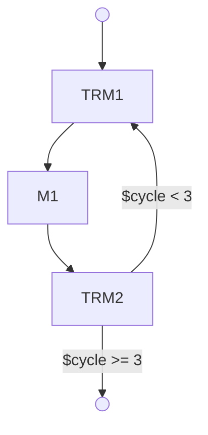

# NeuroScript v2 Proposal: Type-Safe Neural Architecture Composition

## Core Insight

**Validation is the product.** The rest is tooling.

Every block declares what it can handle. The graph validator ensures unbroken compatibility chains. Shape inference enumerates possible configurations. Users pick concrete dimensions. Invalid graphs are rejected before wasting compute.

---

## Design Principles

1. **Capability-based composition** - blocks declare requirements and capabilities, not just shapes
2. **Static validation** - catch errors at compile time, not runtime
3. **Shape inference** - enumerate valid configurations, let user choose
4. **Fork-and-extend** - if a block doesn't support your use case, fork it
5. **Explicit over implicit** - no magic, clear error messages

---

## Block Specification

Every block is a capability declaration:

```yaml
# blocks/transformer/block.yaml
name: TransformerBlock
version: 2.1.0

capabilities:
  inputs:
    x:
      type: Tensor
      dtype: [float32, float16, bfloat16]
      shape: [batch, sequence, dim]
      constraints:
        - sequence >= 1
        - dim in [128, 256, 512, 768, 1024]

  outputs:
    y:
      type: Tensor
      dtype: input.x.dtype  # preserve dtype
      shape: [batch, sequence, dim]  # preserve shape

  parameters:
    layers:
      type: int
      range: [1, 24]
      default: 6
    heads:
      type: int
      constraint: dim % heads == 0  # must divide evenly
      default: 8
    dropout:
      type: float
      range: [0.0, 0.5]
      default: 0.1

  compute:
    params: dim^2 * layers * 12  # approximate parameter count
    flops: 2 * sequence^2 * dim * layers * 12  # approximate FLOPs
    memory: batch * sequence * dim * 4  # activation memory (bytes)
```

### Capability Language

**Shape patterns:**
- `[batch, sequence, dim]` - named dimensions
- `[*, *, 512]` - wildcard for any size
- `[batch, *, *]` - batch dimension required, others flexible

**Constraints:**
- `dim in [128, 256, 512]` - enumerated values
- `dim % 8 == 0` - divisibility requirement
- `sequence >= 1` - range constraint
- `dim == input.x.shape[2]` - reference input dimensions

**Type propagation:**
- `dtype: input.x.dtype` - preserve input dtype
- `shape: [batch, sequence, dim*2]` - transform dimensions
- `device: input.x.device` - preserve device placement

---

## Graph Validation

The validator analyzes the entire graph to ensure compatibility:

### 1. Shape Compatibility Check

```yaml
# architecture.yaml
components:
  encoder:
    block: transformer:v2.1.0
    params:
      layers: 6
      dim: 512

  decoder:
    block: mamba:v1.0.0
    params:
      expand: 2

topology:
  input -> encoder -> decoder -> output
```

**Validator logic:**

```python
# Load block capabilities
encoder_caps = load_block("transformer:v2.1.0")
decoder_caps = load_block("mamba:v1.0.0")

# Check encoder.output compatible with decoder.input
encoder_output_shape = encoder_caps.outputs['y'].shape  # [batch, sequence, 512]
decoder_input_shape = decoder_caps.inputs['x'].shape     # [batch, sequence, dim]

# Unify shapes
unify([batch, sequence, 512], [batch, sequence, dim])
# → dim = 512 ✓ valid

# Check constraints
decoder_caps.inputs['x'].constraints:  # dim in [256, 512, 1024]
# → 512 ✓ valid
```

### 2. Constraint Satisfaction

Given a graph, enumerate all valid configurations:

```python
# Example: Encoder -> Decoder
# Encoder supports dim in [256, 512, 768]
# Decoder supports dim in [256, 512, 1024]

valid_configs = [
    {encoder.dim: 256, decoder.dim: 256},
    {encoder.dim: 512, decoder.dim: 512},
]
# 768 and 1024 are invalid (no intersection)
```

### 3. Shape Inference Engine

User specifies input/output, solver finds valid paths:

```yaml
inference:
  input:
    shape: [32, 128, 256]  # batch=32, seq=128, dim=256
  output:
    shape: [32, 128, 512]  # want dim=512 at output
```

**Solver:**
```python
# Backward pass: what must decoder output?
decoder.output.shape = [32, 128, 512]
# → decoder.dim = 512

# What must decoder input?
decoder.input.shape = [32, 128, 512]  # preserves shape

# What must encoder output?
encoder.output.shape = [32, 128, 512]
# → encoder.dim = 512

# What must encoder input?
encoder.input.shape = [32, 128, 512]  # preserves shape

# Check: does input shape match?
input: [32, 128, 256]
encoder requires: [32, 128, 512]
# ✗ INVALID - need adapter or different config
```

**Solution:**
```yaml
# Add dimension adapter
components:
  adapter:
    block: linear:v1.0.0
    params:
      in_dim: 256
      out_dim: 512
  encoder:
    block: transformer:v2.1.0
    params:
      dim: 512

topology:
  input -> adapter -> encoder -> decoder -> output
```

Validator re-runs, now succeeds ✓

---

## Validation Workflow

```bash
# 1. Write architecture
$ cat architecture.yaml
components:
  encoder: Transformer(dim=512)
  decoder: Mamba(expand=2)
topology:
  input -> encoder -> decoder -> output

# 2. Validate without specifying shapes
$ neuroscript validate architecture.yaml

✓ Graph structure valid
✓ Block connections compatible
✓ No cyclic dependencies

Possible configurations (3 found):
  1. dim=256  (params: 12M, memory: 2.1GB)
  2. dim=512  (params: 48M, memory: 8.4GB)
  3. dim=1024 (params: 192M, memory: 33.6GB)

# 3. Pick a configuration
$ neuroscript validate architecture.yaml --input-shape [32,128,256]

✗ Validation failed

Error: Shape mismatch at encoder->decoder
  encoder output: [32, 128, 512]
  decoder input requires: [32, 128, dim] where dim in [256, 512, 1024]

  Encoder transforms dim=256 -> dim=512
  Decoder expects same dim throughout

Suggested fixes:
  1. Add adapter: Linear(512 -> 256)
  2. Change encoder config: dim=256
  3. Change input shape: [32, 128, 512]

# 4. Apply fix
$ neuroscript validate architecture.yaml --input-shape [32,128,512]

✓ Valid configuration
  Input:  [32, 128, 512]
  Output: [32, 128, 512]

  Total params: 48.2M
  Peak memory: 8.4GB
  Estimated FLOPs: 2.1T

IR generated from NeuroScript feeds directly into:

* NACE’s architectural compiler
* ForkPoint’s lineage format
* Construct’s codegen

---

## 🚀 Current Capabilities (Post Phase 2)

### ✅ Validation Pipeline Complete

The NeuroScript v2 validation system is now fully functional with these capabilities:

**Shape Validation**
- Shape pattern unification with wildcards (`*`, named dimensions)
- Dimension consistency checking across graph connections
- Clear error messages with expected vs actual shapes
- Support for shape transformations and preservation

**Hardware Detection**
- Automatic CUDA availability detection
- GPU compute capability and memory reporting
- CPU core and system memory detection
- Hardware compatibility checking for blocks
- Memory usage estimation and warnings

**Constraint Solving**
- Enumerates all valid dimension configurations
- Detects conflicting constraints early
- Applies parameter ranges and enumerations
- Supports modulo and equality constraints
- Provides configuration suggestions

**Graph Validation**
- End-to-end validation orchestration
- Actionable error messages with fix suggestions
- Block reference validation with fuzzy suggestions
- Cycle detection and topology validation
- Hardware compatibility integration

### 📊 Test Coverage

- **199 passing tests** covering all Phase 2 components
- Full unit test coverage for individual validators
- Integration tests for end-to-end validation
- Error message quality and suggestion testing

---

## 🐛 Known Issues & Limitations

### Current Limitations
- No block implementations yet (Phase 4 pending)
- No compilation to executable code (Phase 3 pending)
- YAML configuration files not yet implemented
- No Docker container execution (Phase 3 pending)

### Dependencies
- Hardware detection requires `torch` and `psutil` (optional dependencies)
- Full functionality available when dependencies are installed

### Next Steps
- Phase 3: Compilation Engine and Container Runtime
- Phase 4: Example block implementations
- Phase 5: Integration testing and documentation

---

## NeuroScript v2 Implementation Status

The v2 system is a complete type-safe neural architecture composition system. Progress:

- ✅ **Phase 1: Core Infrastructure (Tasks 1-4)** - Complete
  - ✅ BlockInterface Protocol
  - ✅ CapabilityParser
  - ✅ BlockRegistry
  - ✅ GraphLoader
- ✅ **Phase 2: Validation Pipeline (Tasks 5-8)** - Complete
  - ✅ ShapeValidator (Task 5) - Handles shape unification and wildcard matching
  - ✅ HardwareDetector (Task 6) - CUDA/CPU/memory detection and compatibility
  - ✅ ConstraintSolver (Task 7) - Enumerates valid configurations and detects conflicts
  - ✅ GraphValidator (Task 8) - Orchestrates validation with actionable error messages
- ⏳ **Phase 3: Compilation & Execution (Tasks 9-10)** - Next
- ⏳ **Phase 4: Example Blocks (Tasks 11-15)** - Planned
- ⏳ **Phase 5: Integration & Testing (Tasks 16-21)** - Planned

**Current Status:** Phase 2 validation pipeline is fully implemented and tested with 199 passing tests. Ready for Phase 3 implementation.

See `specs/04-tasks.md` for detailed task breakdown.

---

## 🔭 Roadmap

### **✅ 2.0 — Phase 2 Complete (Current)**

* ✅ Complete validation pipeline implemented
* ✅ Shape unification with wildcards
* ✅ Hardware detection and compatibility
* ✅ Constraint solving and configuration enumeration
* ✅ Actionable error messages with suggestions
* ✅ 199 passing tests

### **🔄 3.0 — Phase 3: Compilation & Execution (Next)**

* [ ] CompilationEngine - Generate PyTorch code from validated architectures
* [ ] ContainerRuntime - Execute models in Docker with resource limits
* [ ] Shape assertions in generated code
* [ ] Resource-aware execution planning
* [ ] Integration testing with real PyTorch blocks

### **⏳ 4.0 — Phase 4: Example Blocks**

* [ ] Create core blocks: Linear, Embedding, Attention, Norm, Activation
* [ ] Define comprehensive capability specifications
* [ ] Implement PyTorch modules for each block
* [ ] Validate with real architectures
* [ ] Documentation and examples

### **⏳ 5.0 — Phase 5: Integration & Testing**

* [ ] End-to-end testing with compilation
* [ ] Performance optimization
* [ ] Documentation site
* [ ] Community contributions workflow
* [ ] Production deployment tools

---

## 📝 Example

A medium‑complexity block with subgraphs, guards, and recursion:



---

## Advanced Features

### 1. Multi-Path Graphs

```yaml
topology:
  input -> encoder -> decoder -> output
  encoder -> skip_connection -> output  # residual
```

**Validation:**
- Decoder output: `[batch, seq, dim]`
- Skip connection: `[batch, seq, dim]`
- Merge operation (add): requires same shape ✓

### 2. Conditional Blocks

```yaml
components:
  router:
    block: router:v1.0.0
    outputs: [path_a, path_b]

  expert_a:
    block: transformer:v2.0.0

  expert_b:
    block: mamba:v1.0.0

topology:
  input -> router
  router.path_a -> expert_a -> merge
  router.path_b -> expert_b -> merge
  merge -> output
```

**Validation:**
- Both expert_a and expert_b must output compatible shapes
- Merge block validates input compatibility

### 3. Shape Wildcards

```yaml
# Block accepts any shape, preserves it
capabilities:
  inputs:
    x:
      shape: [*, *, *]  # any 3D tensor
  outputs:
    y:
      shape: input.x.shape  # preserve exactly
```

### 4. Constraint Propagation

```yaml
# Block requires specific relationships
capabilities:
  inputs:
    query:
      shape: [batch, seq_q, dim]
    key:
      shape: [batch, seq_k, dim]
    value:
      shape: [batch, seq_k, dim]
  constraints:
    - key.shape[1] == value.shape[1]  # seq_k must match
    - query.shape[2] == key.shape[2]  # dim must match
```

### 5. Compile

```
$ neuroscript compile architecture.yaml \
    --input-shape [32,128,512] \
    --framework pytorch \
    --output model.py
```
---

## Fork-and-Extend Workflow

When a block doesn't support your requirements:

```bash
# 1. Try to use existing block
$ neuroscript validate arch.yaml --input-shape [32,128,384]

✗ Error: transformer:v2.1.0 does not support dim=384
  Supported: [128, 256, 512, 768, 1024]

# 2. Fork the block
$ neuroscript fork transformer:v2.1.0 ./my-blocks/transformer

Forked to: ./my-blocks/transformer
Edit: ./my-blocks/transformer/block.yaml

# 3. Extend capabilities
$ cat my-blocks/transformer/block.yaml
name: TransformerBlock
version: 2.1.0-custom
capabilities:
  inputs:
    x:
      shape: [batch, sequence, dim]
      constraints:
        - dim in [128, 256, 384, 512, 768, 1024]  # added 384

# 4. Update architecture to use fork
$ cat architecture.yaml
components:
  encoder:
    block: ./my-blocks/transformer  # local path
    params:
      dim: 384

# 5. Validate
$ neuroscript validate architecture.yaml --input-shape [32,128,384]
✓ Valid configuration

# 6. (Optional) Contribute back
$ cd my-blocks/transformer
$ git remote add upstream github.com/neuroscript/blocks
$ git push origin feature/support-dim-384
# Open PR to official repo
```

---

## Implementation Phases

### Phase 0: Specification (1-2 weeks)
- [ ] Finalize capability DSL syntax
- [ ] Define block metadata format
- [ ] Specify validation algorithm
- [ ] Document shape inference rules

### Phase 1: Validator (3-4 weeks)
- [ ] Build capability parser
- [ ] Implement shape unification
- [ ] Build constraint solver
- [ ] Create validation engine
- [ ] Write tests for 20+ edge cases

**Deliverable:**
```bash
neuroscript validate arch.yaml
# → Reports valid/invalid with clear errors
```

### Phase 2: Core Blocks (2-3 weeks)
- [ ] Define 5 core blocks:
  - Linear (dimension transformation)
  - Embedding (vocab → dense)
  - Attention (multi-head attention)
  - Norm (layer/batch/RMS norm)
  - Activation (ReLU/GELU/SiLU)
- [ ] Write capability specs for each
- [ ] Validate specs with test graphs

### Phase 3: Shape Inference (3-4 weeks)
- [ ] Build shape solver (enumerate configs)
- [ ] Implement backward inference (from output)
- [ ] Add constraint propagation
- [ ] Generate suggested fixes for errors

**Deliverable:**
```bash
neuroscript infer arch.yaml --output-shape [32,128,512]
# → Shows required input shape + config
```

### Phase 4: Compiler (4-6 weeks)
- [ ] Config → PyTorch codegen
- [ ] Block instantiation
- [ ] Shape assertions in generated code
- [ ] Training boilerplate

**Deliverable:**
```bash
neuroscript compile arch.yaml --input-shape [32,128,512] -o model.py
python model.py --train
```

### Phase 5: Distribution (2-3 weeks)
- [ ] Git-based block fetcher
- [ ] Version resolver
- [ ] Local cache
- [ ] Fork workflow tooling

### Phase 6: Ecosystem (ongoing)
- [ ] Add 10 more blocks (Transformer, ResNet, Mamba, etc.)
- [ ] Documentation site
- [ ] Example architectures
- [ ] Community contributions

---

## Example: Complete Workflow

### 1. Define Architecture

```yaml
# gpt-nano.yaml
architecture: GPT-Nano
version: 1.0.0

components:
  embedding:
    block: embedding:v1.0.0
    params:
      vocab_size: 50257

  position:
    block: positional-encoding:v1.0.0
    params:
      max_len: 2048

  transformer:
    block: transformer-stack:v2.1.0
    params:
      layers: 12
      heads: 12

  lm_head:
    block: linear:v1.0.0
    params:
      out_features: 50257

topology:
  tokens -> embedding -> emb_out
  tokens -> position -> pos_out
  [emb_out, pos_out] -> add -> transformer -> lm_head -> logits
```

### 2. Validate

```bash
$ neuroscript validate gpt-nano.yaml

✓ Graph structure valid
✓ All blocks found
✗ Shape mismatch at add

Error: add operation requires matching shapes
  emb_out: [batch, seq, dim]
  pos_out: [batch, seq, dim]

  Possible dim values:
    embedding: any (user specified)
    position: any (user specified)
    transformer: [256, 512, 768, 1024]

  Need to specify dim consistently
```

### 3. Fix Configuration

```yaml
components:
  embedding:
    block: embedding:v1.0.0
    params:
      vocab_size: 50257
      embed_dim: 768  # specify

  position:
    block: positional-encoding:v1.0.0
    params:
      max_len: 2048
      embed_dim: 768  # match

  transformer:
    block: transformer-stack:v2.1.0
    params:
      layers: 12
      heads: 12
      dim: 768  # match
```

### 4. Re-validate

```bash
$ neuroscript validate gpt-nano.yaml --input-shape [32,512]

✓ Valid configuration

Architecture Summary:
  Input:  [32, 512] (batch, sequence)
  Output: [32, 512, 50257] (batch, sequence, vocab)

  Parameters: 124.4M
  Memory: 2.1GB (batch=32, seq=512)
  FLOPs: 1.8T per forward pass

Blocks:
  embedding:        38.6M params
  position:         1.6M params
  transformer:      84.2M params (12 layers)
  lm_head:          38.6M params
```

### 5. Compile & Train

```bash
$ neuroscript compile gpt-nano.yaml \
    --input-shape [32,512] \
    --framework pytorch \
    --output model.py

$ python model.py \
    --dataset openwebtext \
    --epochs 10 \
    --lr 1e-4
```

---

## Error Messages (Critical)

Errors must be **actionable**:

### Bad Error:
```
Error: Invalid graph
```

### Good Error:
```
✗ Validation failed at connection: encoder -> decoder

Shape mismatch:
  encoder.output: [batch, 128, 512]
  decoder.input:  [batch, seq, 256] where seq >= 1

Problem: Dimension 2 mismatch (512 vs 256)

Suggested fixes:
  1. Add adapter block:
     encoder -> Linear(512, 256) -> decoder

  2. Change encoder config:
     encoder: Transformer(dim=256)  # currently 512

  3. Change decoder config:
     decoder: Mamba(dim=512)  # currently 256

  4. Use compatible blocks:
     Replace decoder with: mamba-wide:v2.0.0 (supports dim=512)
```

---

## Success Criteria

After Phase 4, this should work end-to-end:

```bash
# 1. Write config (5 minutes)
$ cat > my-model.yaml << EOF
components:
  encoder: Transformer(layers=6, dim=512)
  decoder: Mamba(expand=2, dim=512)
topology:
  input -> encoder -> decoder -> output
EOF

# 2. Validate (instant)
$ neuroscript validate my-model.yaml --input-shape [32,128,512]
✓ Valid - 48M params, 8.4GB memory

# 3. Compile (seconds)
$ neuroscript compile my-model.yaml --input-shape [32,128,512] -o model.py

# 4. Train (hours)
$ python model.py --dataset wikitext --epochs 10
Epoch 1/10: loss=4.234
Epoch 2/10: loss=3.891
...

# 5. Share (instant)
$ git add my-model.yaml
$ git commit -m "Transformer-Mamba hybrid for sequence modeling"
$ git push
# → Anyone can reproduce exactly
```

**If this works, ship it.**

---

## Why This Wins

1. **Catches errors early** - before wasting GPU time
2. **Self-documenting** - capability specs are executable docs
3. **Enables search** - enumerate all valid configs automatically
4. **Forces clarity** - can't hide shape bugs in code
5. **Reproducible by default** - config + version = exact model

The validation IS the product. Everything else is tooling around that core value.

---

## Installation

Install NeuroScript using pip:

```bash
# Install basic package
pip install -e .

# Install with development dependencies
pip install -e ".[dev]"

# Install with CUDA support
pip install -e ".[cuda]"

# Install with all dependencies
pip install -e ".[full]"
```

### Running Tests

```bash
# Run all tests
pytest

# Run with coverage
pytest --cov=src --cov-report=html

# Run specific test file
pytest test/core/test_graph_validator.py

# Run with verbose output
pytest -v
```

---

## Code Quality

This codebase maintains high standards for reliability and maintainability:

### Type Safety
- Full type hints throughout the core modules
- Type checking compatible with mypy
- All public APIs have complete type annotations

### Error Handling
- Specific exception handling for all error cases (no broad `Exception` catches)
- Custom exception classes for each module with clear error messages
- Actionable error messages with suggested fixes
- Safe expression evaluation with restricted eval() environment

### Module Organization
- Clear separation of concerns across components
- Logical grouping of related functionality
- Well-documented public API exports in `__init__.py`
- Consistent import organization

### Testing
- 199+ passing tests covering all Phase 2 components
- Comprehensive unit and integration test coverage
- Test configuration in pytest.ini for easy running
- Clear test organization by component

### Package Structure
- Proper Python packaging with pyproject.toml
- setuptools-compatible setup.py for backward compatibility
- Clear package documentation and examples
- Well-maintained dependencies

### Code Standards
- Consistent naming conventions
- Docstrings for all public functions and classes
- Proper module-level imports (no inline imports in methods)
- Security-conscious implementations (eval restriction, input validation)

---

## Development Workflow

### Contributing

1. Fork and clone the repository
2. Install development dependencies: `pip install -e ".[dev]"`
3. Create a feature branch: `git checkout -b feature/your-feature-name`
4. Write tests for your changes
5. Run tests and ensure all pass: `pytest`
6. Format code with black: `black src test`
7. Submit a pull request

### Code Standards

All code should:
- Pass type checking: `mypy src`
- Follow PEP 8 with 100 character line limit
- Have comprehensive docstrings
- Include tests for new functionality
- Be formatted with black
