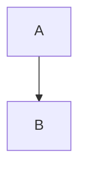
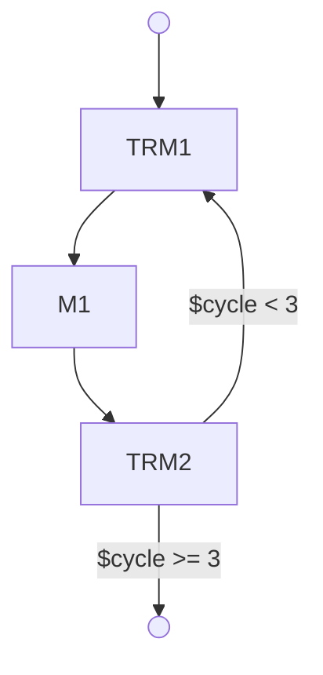

# NeuroScript

### A Declarative Language for Composable Neural Architectures

NeuroScript is a text‑first, declarative DSL for describing neural architectures as clear, composable, evolvable graphs. Instead of burying model structure inside opaque Python files, scattered configs, or framework‑specific boilerplate, NeuroScript expresses architectures in a unified, human‑readable form that can be parsed, visualized, type‑checked, versioned, and shared.

NeuroScript is the foundation of a larger ecosystem designed for architectural clarity, collaborative experimentation, and evolutionary model development.

---

## 🚀 Why NeuroScript Exists

Today, neural architectures are:

* Hidden inside framework code
* Hard to compare or visualize
* Impossible to meaningfully diff
* Painful to fork for experiments
* Not reusable across projects
* Not composable

NeuroScript fixes this by providing:

* **A single representation** for models and submodules
* **Typed, validated, shape‑aware graphs**
* **Declarative node definitions** with explicit parameters
* **Composable blocks** that can be nested, referenced, and inherited
* **A clean IR** that other tools (NACE, ARIES, ForkPoint) can consume

Architectures become first‑class citizens, not an afterthought buried in implementation details.

---

## 🧠 Core Concepts

### **1. Mermaid‑Based Syntax**

NeuroScript uses a Mermaid‑inspired flowchart syntax as the visual layer. Graphs remain valid Mermaid diagrams and can be rendered anywhere Mermaid is supported.



### **2. YAML Frontmatter**

Each file may include `__neuroscript` frontmatter containing:

* configuration sources
* IO definitions
* component defaults
* environment variables

```yaml
---
__neuroscript:
  conf:
    - configs/base.yml
  io:
    type: Tensor
    shape: [128, 128]
---
```

### **3. Node Attributes**

Nodes are extended with declarative metadata:

```text
TRM1@{shape: rect, node: TRMBlock(depth=4), label: "Encoder"}
```

Attributes include:

* shape hint
* node type
* instantiation parameters
* optional label

### **4. Guards & Shape Conditions**

Edges may contain guards or constraints:

```
A -->|$shape fits 64x64x64| B
```

Guards are parsed and passed to the type/shape checker.

### **5. Composition & Blocks**

A NeuroScript file *is* a block, and can be imported by others:

```
node: BlockReference(src/blocks/tiny_recursive_mamba.mmd)
```

This makes architectures modular and reusable.

---

## 📦 What NeuroScript Produces

Parsing a `.mmd` file yields a clean intermediate representation (IR):

* list of nodes
* list of edges
* subgraph scopes
* declared metadata
* extracted variables (e.g., `${CONFIG.data.dim_x}`)
* type info (node type, params, etc.)

This IR is used by:

* **NACE** (live visual/interactive IDE)
* **ForkPoint** (versioned architectural lineage)
* **ARIES** (automated experiment generation)
* **Construct** (high‑level model programming language)

---

## 🔧 Tooling

### **Parser (Python prototype)**

A minimal Python parser handles:

* YAML frontmatter
* node attributes
* edges and guards
* variable extraction
* IR emission

This will be replaced later with:

* a complete Mermaid grammar
* an incremental parser for use inside NACE

### **Rust Backend Integration**

IR generated from NeuroScript feeds directly into:

* NACE’s architectural compiler
* ForkPoint’s lineage format
* Construct’s codegen

---

## NeuroScript v2 Implementation Status

The v2 system is a complete type-safe neural architecture composition system. Progress:

- ✅ Phase 1: Core Infrastructure (Tasks 1-4)
  - BlockInterface Protocol
  - CapabilityParser
  - BlockRegistry
  - GraphLoader
- ⏳ Phase 2: Validation Pipeline (Tasks 5-8)
- ⏳ Phase 3: Compilation & Execution (Tasks 9-10)
- ⏳ Phase 4: Example Blocks (Tasks 11-15)
- ⏳ Phase 5: Integration & Testing (Tasks 16-21)

See `specs/04-tasks.md` for detailed task breakdown.

---

## 🔭 Roadmap

### **0.1 — Current**

* Working parser
* Language spec
* Valid Mermaid subset
* Node/type extraction

### **0.2 — Next**

* Full config resolution
* Guard expression evaluator
* Shape/type checker

### **0.3 — NACE Integration**

* Live graph editing
* Inline warnings/errors
* IR ↔ Rust serialization

### **0.4 — Ecosystem Integration**

* Phylogenesis Repo: shared architecture blocks
* ARIES experiment autogeneration
* ForkPoint lineage linking

---

## 📝 Example

A medium‑complexity block with subgraphs, guards, and recursion:



---

## 🧬 Philosophy

Neural networks today are designed the way circuits were before schematic capture: improvised, inconsistent, and siloed. NeuroScript brings the equivalent of **HDL + schematic capture + package ecosystem** to ML — a universal architectural medium where models can be designed, reasoned about, shared, and evolved.

NeuroScript is not a convenience.
It is a missing layer of the ML stack.

---

## License

MIT

```sh
python src/tools/parser.py src/blocks/apoptotic_model.mmd > build/blocks/apoptotic_model.json

python src/tools/parser.py src/blocks/tiny_recursive_mamba.mmd > build/blocks/tiny_recursive_mamba.json
```
