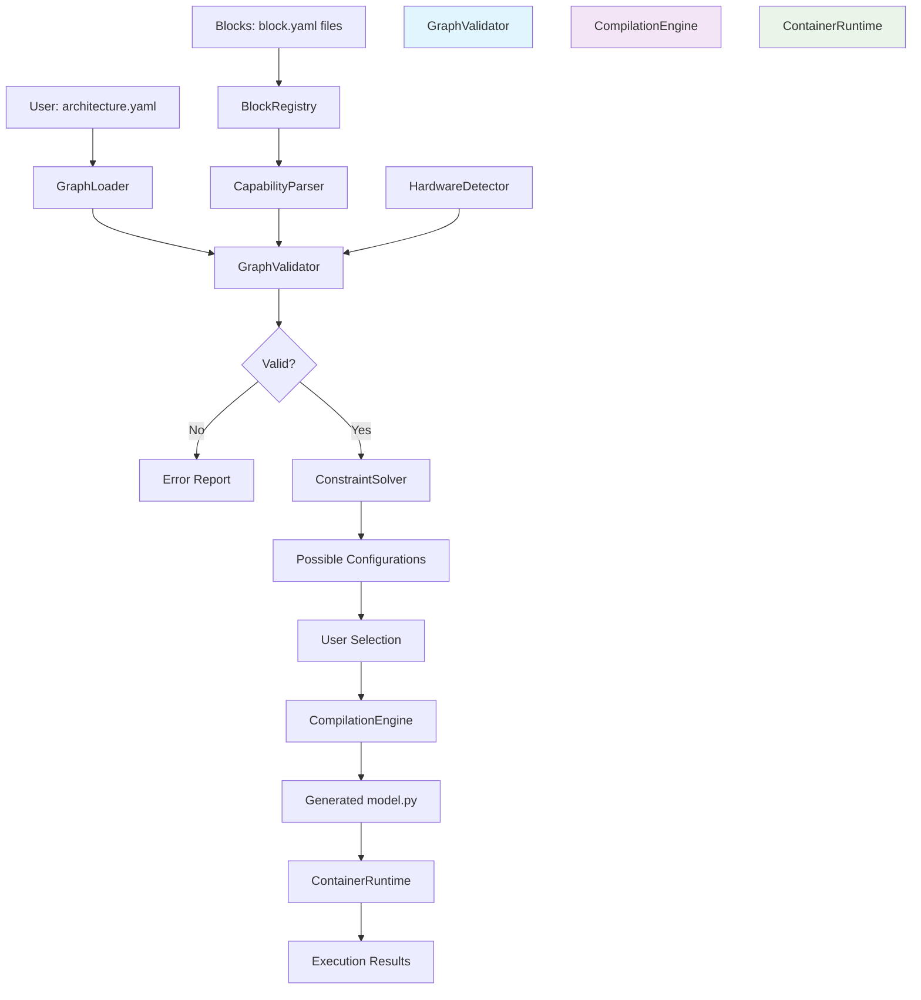

# Architectural Blueprint

## 1. Core Objective

Build a type-safe neural architecture composition system that validates block compatibility through capability-based shape inference before execution, automatically detects hardware constraints (CUDA/CPU/memory), and executes validated architectures in resource-controlled containers to enable safe experimentation on diverse hardware from high-end GPUs to MacBooks.

## 2. System Scope and Boundaries

### In Scope
- Block capability specification format (YAML schema with shape/dtype constraints)
- Graph validation engine (shape compatibility checking across connections)
- Hardware capability detection (CUDA compute capability, available memory, CPU cores)
- Container-based execution runtime (Docker with resource limits)
- 15 initial blocks (Embedding, Attention, FFN, TransformerBlock, MambaBlock, Linear, LayerNorm, Dropout, GELU, LoRA, MixtureOfExperts, FlashAttention, ResNetBlock, LSTM, Sequential)
- 5 example blocks for testing (Linear, Embedding, LayerNorm, Dropout, Sequential)
- PyTorch code generation from validated architectures
- Architecture YAML format for composing blocks
- Block discovery and loading system

### Out of Scope
- JAX/TensorFlow code generation (PyTorch only for v2.0)
- Kubernetes orchestration (Docker only)
- Training loop implementation (compilation only, users provide training code)
- Distributed training support
- Model quantization/optimization
- Web UI/visual editor (CLI only for v2.0)
- Block versioning and dependency resolution (single version per block for v2.0)
- Automatic hyperparameter tuning

## 3. Core System Components

| Component Name | Single Responsibility |
|---|---|
| **BlockInterface** | Defines the protocol contract that all blocks must implement (capability declaration, forward pass, metadata) |
| **BlockRegistry** | Discovers, loads, and indexes available blocks from the filesystem |
| **CapabilityParser** | Parses block.yaml capability specifications into structured constraint objects |
| **ShapeValidator** | Validates tensor shape compatibility between connected blocks using unification |
| **ConstraintSolver** | Enumerates valid shape configurations satisfying all block constraints across the graph |
| **HardwareDetector** | Detects available hardware (CUDA capability, CPU cores, memory) and filters compatible blocks |
| **GraphLoader** | Loads architecture YAML files and constructs internal graph representation |
| **GraphValidator** | Orchestrates validation of entire architecture graph (topology, shapes, constraints) |
| **CompilationEngine** | Generates executable PyTorch code from validated architecture graphs |
| **ContainerRuntime** | Executes generated models in Docker containers with resource limits |

## 4. High-Level Data Flow

## 5. Key Integration Points

### Internal Component Communication
- **BlockRegistry ↔ CapabilityParser**: File paths → Parsed capability objects
- **GraphLoader ↔ GraphValidator**: Architecture dict → Validation result
- **GraphValidator ↔ ShapeValidator**: Edge pairs → Compatibility boolean
- **GraphValidator ↔ ConstraintSolver**: Graph + constraints → Valid configurations list
- **HardwareDetector ↔ GraphValidator**: Hardware capabilities → Block filter criteria
- **GraphValidator ↔ CompilationEngine**: Validated graph + config → Code generation request
- **CompilationEngine ↔ ContainerRuntime**: Generated code path → Execution command

### Data Formats
- **Block Capabilities**: YAML with nested dicts (inputs/outputs/params/constraints)
- **Architecture Specification**: YAML with components and topology sections
- **Graph Representation**: Python dict with nodes/edges/metadata
- **Validation Results**: Typed dataclass with status/errors/suggestions
- **Generated Code**: Python module with PyTorch nn.Module subclass

### External Integrations
- **Filesystem**: Read block.yaml and architecture.yaml files
- **Docker Daemon**: Execute containers via Docker Python SDK
- **PyTorch**: Import for code generation and hardware detection
- **YAML Parser**: pyyaml for configuration loading

### Authentication/Security
- Container execution sandboxed with no host network access
- Resource limits enforced (CPU/memory quotas)
- No external network access in containers (air-gapped execution)
- Block code loaded from trusted local directories only (no remote fetching in v2.0)
